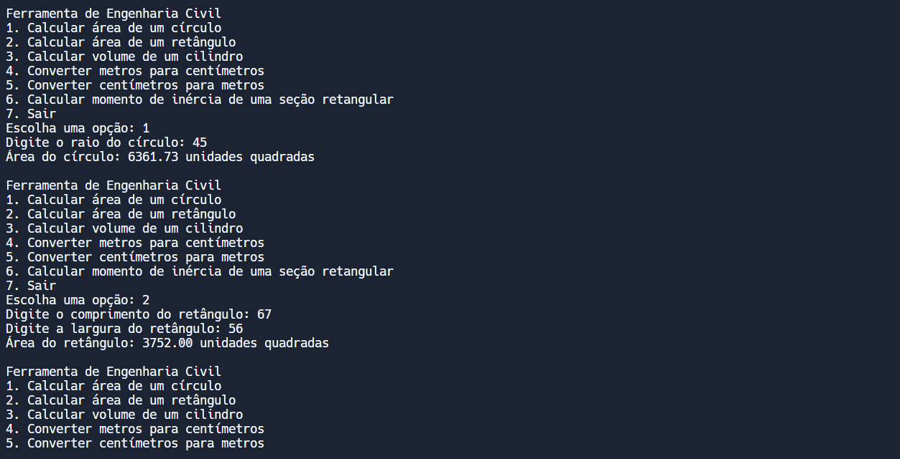
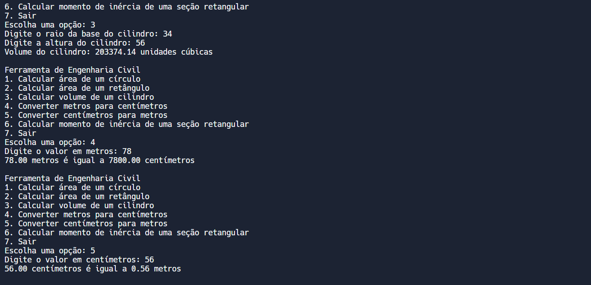

# ENGENHARIA CIVIL TOOL
👨‍🏫ESSA FERRAMENTA INCLUI CÁLCULOS DE ÁREAS, VOLUMES, CONVERSÕES DE UNIDADES E CÁLCULOS ESTRUTURAIS BÁSICOS.

 <br>
 <br>
 <br>

## DESCRIÇÃO:
Este projeto é uma ferramenta de engenharia civil escrita em Pascal, projetada para fornecer funcionalidades úteis aos engenheiros civis. A ferramenta inclui cálculos de áreas, volumes, conversões de unidades e cálculos estruturais básicos, com validação de entrada para garantir que os dados fornecidos pelo usuário sejam válidos.

## FUNCIONALIDADES:
1. **Cálculos Geométricos**:
   - **Área de um Círculo**: Calcula a área de um círculo com base no raio fornecido pelo usuário.
   - **Área de um Retângulo**: Calcula a área de um retângulo com base no comprimento e na largura fornecidos pelo usuário.
   - **Volume de um Cilindro**: Calcula o volume de um cilindro com base no raio da base e na altura fornecidos pelo usuário.

2. **Conversões de Unidades**:
   - **Converter Metros para Centímetros**: Converte um valor em metros para centímetros.
   - **Converter Centímetros para Metros**: Converte um valor em centímetros para metros.

3. **Cálculos Estruturais**:
   - **Momento de Inércia de uma Seção Retangular**: Calcula o momento de inércia de uma seção retangular com base na base e na altura fornecidas pelo usuário.

4. **Validação de Entrada**:
   - Verifica se as entradas fornecidas pelo usuário são números válidos.
   - Solicita a entrada novamente se uma entrada inválida for fornecida.

## COMO USAR?
1. **Compilar o código**:
   - Navegue até o diretório `./CODIGO`, e digite o seguinte comando para compilar o código:

   ```bash
   fpc main.pas
   ```

   - Isso vai gerar um arquivo executável:
      - **Windows**: `main.exe`
      - **Linux/macOS**: `main` (sem extensão).

2. **Executar o arquivo compilado**:
   - Depois de compilar o código, você pode executar o arquivo compilado diretamente no terminal:
   
   - **Windows**:
   ```bash
   main.exe
   ```

   - **Linux/macOS**:
   ```bash
   ./main
   ```

3. **Menu de Entrada**:
   - Ao iniciar o programa, um menu é exibido com as opções disponíveis.
   - O usuário escolhe uma das opções digitando o número correspondente e pressionando Enter.

4. **Entrada de Dados**:
   - Para cada operação, o programa solicita os dados necessários (medidas geométricas ou valores de conversão) e valida as entradas.
   - Se uma entrada inválida for fornecida, o programa exibirá uma mensagem de erro e solicitará a entrada novamente.

5. **Cálculo e Resultado**:
   - O programa realiza o cálculo correspondente e exibe o resultado no console.

6. **Repetição ou Encerramento**:
   - Após exibir o resultado, o programa retorna ao menu principal, permitindo ao usuário realizar novas operações.
   - O usuário pode encerrar o programa escolhendo a opção "Sair".

## NÃO SABE?
- Entendemos que para manipular arquivos em muitas linguagens e tecnologias, é necessário possuir conhecimento nessas áreas. Para auxiliar nesse aprendizado, oferecemos cursos gratuitos disponíveis:
* [CURSO DE PASCAL](https://github.com/VILHALVA/CURSO-DE-PASCAL)
* [CONFIRA MAIS CURSOS](https://github.com/VILHALVA?tab=repositories&q=+topic:CURSO)

## CREDITOS:
- [PROJETO CRIADO PELO VILHALVA](https://github.com/VILHALVA)


